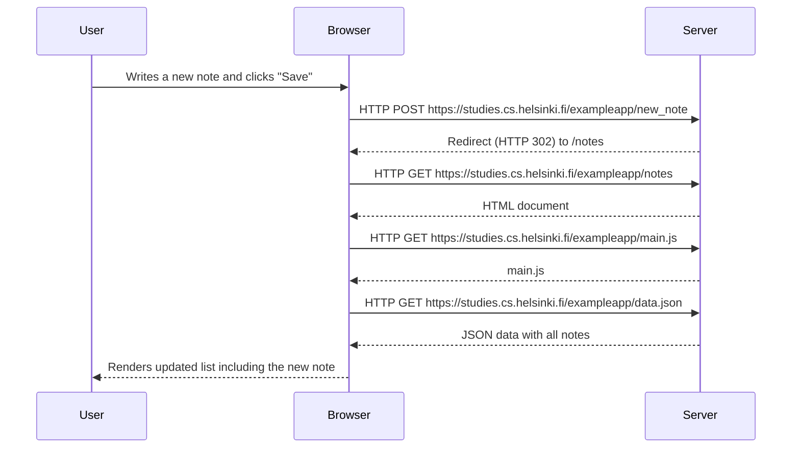

# Exercise 0.4 – New Note Diagram

```mermaid
sequenceDiagram
    participant User
    participant Browser
    participant Server

    User->>Browser: Writes a new note and clicks "Save"
    Browser->>Server: HTTP POST https://studies.cs.helsinki.fi/exampleapp/new_note
    Server-->>Browser: Redirect (HTTP 302) to /notes
    Browser->>Server: HTTP GET https://studies.cs.helsinki.fi/exampleapp/notes
    Server-->>Browser: HTML document
    Browser->>Server: HTTP GET https://studies.cs.helsinki.fi/exampleapp/main.js
    Server-->>Browser: main.js
    Browser->>Server: HTTP GET https://studies.cs.helsinki.fi/exampleapp/data.json
    Server-->>Browser: JSON data with all notes
    Browser-->>User: Renders updated list including the new note
```